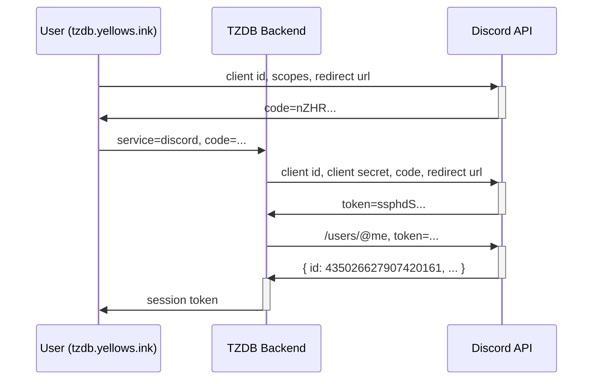
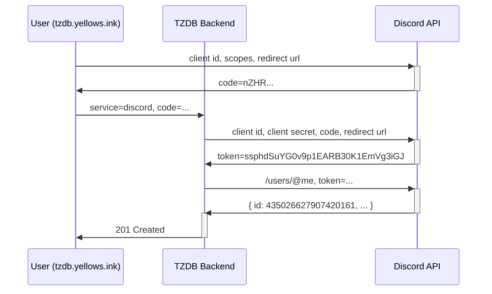

# Auth Docs

## Logging into TZDB

Explained as quick & easy as possible:
1. Authenticate with an external service
2. Post the OAuth code to `/auth/login`
3. Get a session token (see API.md for more info on this token)

And a diagram of an auth flow with Discord:
(this is identical to the diagram below,
but you get a session token at the end, not just an empty response)

## Authenticating with an external service

Usually, when you use OAuth, you go to an external sign in page,
and get sent back with a code.

You would usually then exchange that code for an API / Bearer token.

Unfortunately, some services (like Discord) do not provide an auth flow designed
without a client secret, a kind of OAuth flow often used for single page apps etc.

Due to this, the intermediary code should be sent to the TZDB worker as your
proof of successful authentication.
The worker can then add the client secret, obtain a bearer token,
and verify your account.

For service-specific things like the login URL,
what parameters must be passed to that URL,
and what value from the response must be forwarded to TZDB,
see SERVICES.md

